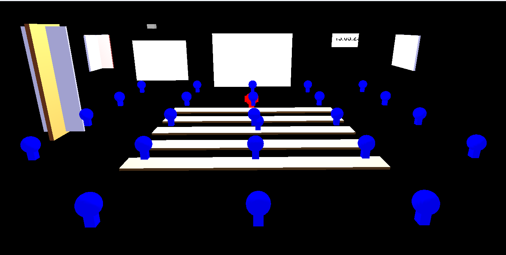
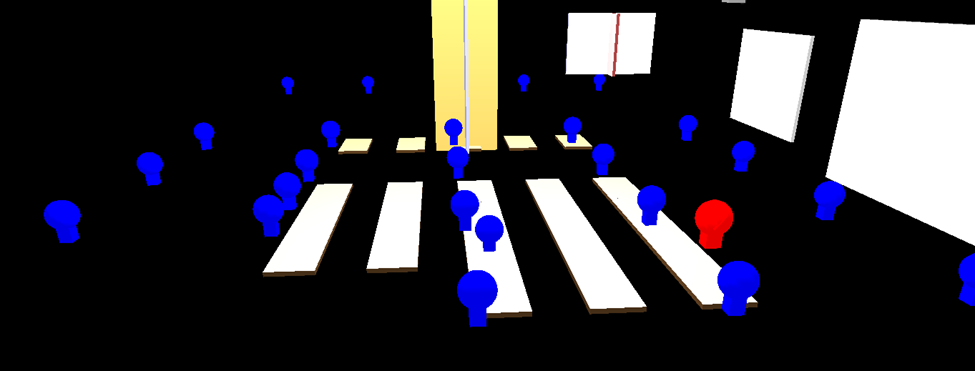
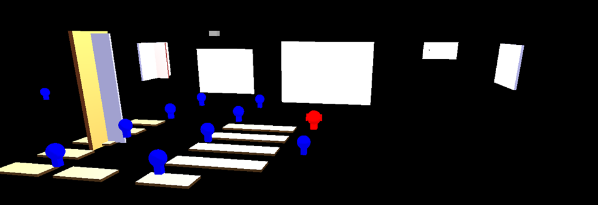

# Classroom Animation with OpenGL





## Description
This project is a 3D classroom animation built using OpenGL and GLUT. It features a virtual classroom environment with interactive elements including:
- Lecturer and student characters
- Whiteboard with text
- Projector system
- Functional digital clock
- Interactive doors and windows

## Features
### Interactive Characters
- Lecturer (controlled with arrow keys)
- Student (controlled with WASD keys)

### Classroom Elements
- Whiteboard with text
- Projector with adjustable light
- Digital clock showing real time
- Opening/closing door
- Windows with curtains

### Lighting Controls
- Classroom lighting toggle (B key)
- Projector spotlight toggle (P key)

## Controls
| Key       | Action                      |
|-----------|-----------------------------|
| Arrow Keys| Move lecturer               |
| WASD      | Move student                |
| , / .     | Rotate camera view          |
| G / H     | Zoom in/out                 |
| C         | Toggle clock visibility     |
| P         | Toggle projector light      |
| B         | Toggle classroom lights     |
| O         | Open/close door             |
| K         | Open/close curtains         |
| Space     | Toggle automatic movement   |
| E         | Start students exiting      |
| R         | Start students entering     |

## Requirements
- C++ compiler (GCC, Clang, or MSVC)
- OpenGL libraries
- GLUT (OpenGL Utility Toolkit)

## Installation
1. Install dependencies:
   ```bash
   sudo apt-get install freeglut3-dev  # Linux
   # OR
   brew install freeglut               # Mac